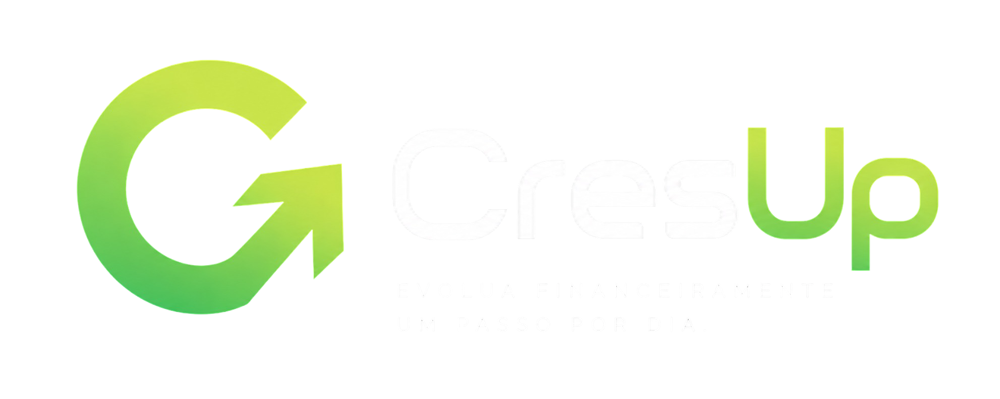
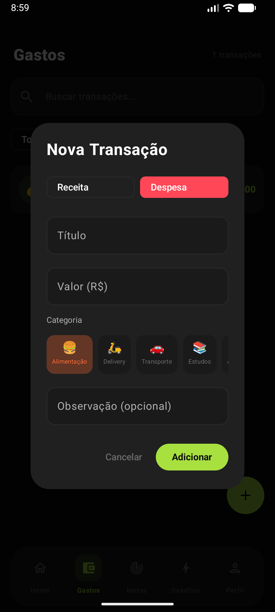
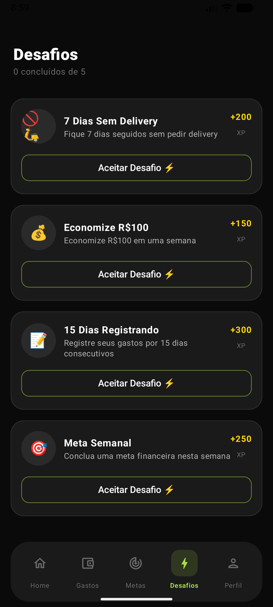
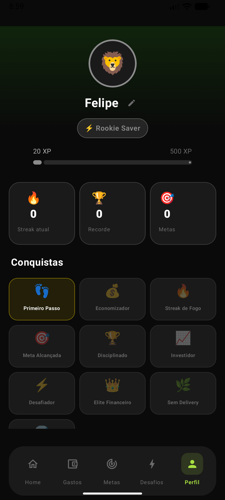

<p align="center">
  
  
  
  
  
</p>

---

<p align="center">
  <b>Felipe Guilherme Teodolino</b> · RA 212392 &nbsp;|&nbsp;
  <b>Carlos Eduardo Santos Silva</b> · RA 213032 &nbsp;|&nbsp;
  <b>Carlos Eduardo Brandão Souza</b> · RA 202493<br/>
  <b>Phelippe Oliveira Santos</b> · RA 211268 &nbsp;|&nbsp;
  <b>Vinicios Santos Silva</b> · RA 212553 &nbsp;|&nbsp;
  <b>Caio Santos Ferreira</b> · RA 209281<br/>
  <sub>Disciplina de Programação Mobile — UNASP</sub>
</p>

---

## Descrição

CresUp é uma plataforma de evolução financeira pessoal gamificada com aparência premium de 2026. Inspirado em Nubank, Revolut, Duolingo e Habitica, transforma o controle financeiro em uma experiência motivadora para a Geração Z: registre transações, crie metas, aceite desafios e evolua com XP, níveis, conquistas e streaks.

## Tecnologias

| Tecnologia | Versão | Uso |
|---|---|---|
| Kotlin | 2.1.0 | Linguagem principal |
| Jetpack Compose | BOM 2024.12 | Interface declarativa |
| Material Design 3 | — | Sistema de design + Material Icons |
| MVVM + Clean Architecture | — | Arquitetura em 3 camadas |
| Hilt | 2.51.1 | Injeção de dependência |
| Room | 2.6.1 | Persistência local (SQLite) |
| Firebase Firestore | BOM 33.10 | Banco de dados em nuvem (tempo real) |
| Firebase Auth | BOM 33.10 | Autenticação e-mail + Google |
| Retrofit + OkHttp | 2.11 / 4.12 | Consumo de API REST |
| Coroutines + StateFlow | 1.9.0 | Assincronismo reativo |
| Navigation Compose | 2.8.5 | Navegação entre telas |
| Coil | 2.7.0 | Carregamento de imagens |

## Requisitos do Sistema

- Android 8.0+ (API 26)
- Android Studio Ladybug | 2024.2.1+
- JDK 17

## Instalação

```bash
# Clone o repositório
git clone https://github.com/felipeXZZ/CresUp-Financas-Gamificadas.git
cd CresUp-Financas-Gamificadas

# Abra no Android Studio e sincronize o Gradle
# Execute no dispositivo ou emulador
```

## Estrutura do Projeto

```
app/src/main/java/com/cresup/app/
├── data/
│   ├── local/          # Room: entities, DAOs, AppDatabase
│   ├── remote/         # Retrofit: QuoteApi, DTOs; Firebase: repositórios Firestore
│   └── repository/     # Implementações dos repositórios
├── di/                 # AppModule (Hilt)
├── domain/
│   ├── model/          # User, Transaction, Goal, Challenge, Achievement
│   └── repository/     # Interfaces dos repositórios
└── presentation/
    ├── ui/
    │   ├── components/  # GlassCard, TransactionItem, CurrencyVisualTransformation
    │   ├── navigation/  # NavGraph, CresUpBottomNav
    │   ├── screens/     # dashboard, gastos, metas, desafios, perfil, analytics, auth, onboarding, splash
    │   └── theme/       # Color, Type, Theme
    └── viewmodel/       # AuthVM, DashboardVM, GastosVM, MetasVM, DesafiosVM, PerfilVM, AnalyticsVM
```

## Funcionalidades

### Dashboard
- Patrimônio total em tempo real (saldo acumulado)
- Resumo mensal: receitas, despesas, economia — com ícones Material
- Gráfico inline de gastos por categoria (top 4) com barras animadas
- Botão **"Ver análise"** → tela de Análises
- Progresso de XP e nível com indicador circular animado
- Streak badge (LocalFireDepartment icon)
- Meta ativa com barra de progresso
- Frase motivacional via ZenQuotes API (fallback local)
- Últimas 5 transações com ícones por categoria

### Gastos
- Adicionar receitas e despesas com 11 categorias
- Cada categoria com ícone Material exclusivo (sem emojis)
- Busca e filtro por tipo (Todos / Receitas / Despesas)
- Swipe-to-delete com confirmação visual
- Feedback de XP ao registrar transações

### Metas
- Criar metas com presets (Viagem, iPhone, Setup Gamer, etc.)
- Contribuir para metas com qualquer valor
- Barra de progresso animada + percentual
- Detecção automática de meta concluída

### Desafios
- 5 desafios com **nível de dificuldade**: Fácil / Médio / Difícil
- Badge de dificuldade colorido (verde / amarelo / vermelho)
- Ícones exclusivos por desafio (sem emojis)
- Progresso geral no cabeçalho
- Recompensa de XP variável ao concluir

### Análises *(tela exclusiva)*
- Cards de métricas: receita, gastos, taxa de economia, média diária
- Gráfico de barras horizontais animado por categoria de gasto
- Trend mensal: variação % de gastos vs mês anterior
- **Insights financeiros automáticos** (rule-based):
  - Alerta se gastos superam receita
  - Parabéns se taxa de economia ≥ 30%
  - Destaque da categoria que domina os gastos
  - Tendência de alta/queda vs mês anterior
  - Reconhecimento de streak e nível

### Perfil
- Avatar com ícone (Material Icon) + borda colorida por nível
- Nome editável
- **Coins badge** (moeda virtual da gamificação)
- Nível e XP com barra de progresso linear
- Estatísticas: streak atual, recorde, metas concluídas (ícones coloridos)
- **15 conquistas** com sistema de raridade (Comum / Raro / Épico / Lendário)
- Cada conquista tem ícone Material + cor de raridade

## Gamificação

| Ação | XP Ganho |
|---|---|
| Registrar despesa | +10 XP |
| Registrar receita | +20 XP |
| Criar meta | +30 XP |
| Contribuir para meta | +25 XP |
| Concluir desafio | +XP variável |

### Níveis

| Nível | Nome | XP necessário |
|---|---|---|
| 1 | Poupador Iniciante | 0 – 499 |
| 2 | Construtor de Riqueza | 500 – 1.499 |
| 3 | Especialista Financeiro | 1.500 – 3.499 |
| 4 | Elite Financeira | 3.500+ |

### Conquistas

| Conquista | Raridade | Condição |
|---|---|---|
| Primeiro Passo | Comum | Primeira transação |
| Economizador | Comum | Primeira economia |
| Streak de Fogo | Raro | 7 dias de streak |
| Meta Alcançada | Raro | Primeira meta concluída |
| Disciplinado | Épico | 30 dias de streak |
| Investidor | Raro | Primeiro investimento |
| Desafiador | Comum | Primeiro desafio concluído |
| Elite Financeiro | Lendário | Nível 4 atingido |
| Sem Delivery | Raro | 7 dias sem delivery |
| Milionário do XP | Épico | 5.000 XP acumulados |
| Construtor | Raro | 5 metas criadas |
| Centurião | Épico | 100 transações registradas |
| Poupador de Elite | Épico | R$1.000 economizados |
| Conquistador | Lendário | Todos os desafios concluídos |
| Maratonista | Lendário | 100 dias de streak |

## Frases Motivacionais

O app exibe 12 frases motivacionais curadas em português na tela inicial. A stack Retrofit + OkHttp e a integração com a ZenQuotes API estão implementadas no código para futura expansão, mas as frases são servidas localmente para garantir disponibilidade offline e idioma consistente.

## Tratamento de Erros

- Validação nos ViewModels antes de qualquer operação de I/O
- Frases motivacionais sempre disponíveis (armazenadas localmente em português)
- `try-catch` em todos os repositórios
- Snackbars para feedback de sucesso e erro
- Estados de vazio com ilustrações em todas as telas
- Erros Firebase mapeados para mensagens em português
- Guarda de processamento nos desafios (`processingIds`) para evitar double-tap e race conditions

## Distribuição

O app está publicado na **Google Play Store** em teste fechado (12 testadores).

O pacote de distribuição `app-release.aab` (AAB assinado, ~21 MB) foi gerado via:

**Android Studio → Build → Generate Signed Bundle / APK → Android App Bundle**

Ou via terminal:
```bash
./gradlew bundleRelease
```

## Relatório Técnico

O relatório técnico detalhado do projeto está disponível em [RELATORIO_TECNICO.md](RELATORIO_TECNICO.md).

## Capturas de Tela

<p align="center">
  
  
  
</p>
<p align="center">
  
  
</p>

## Autores

Projeto acadêmico — Disciplina de Programação Mobile, UNASP

| Nome | RA |
|---|---|
| Felipe Guilherme Teodolino | 212392 |
| Carlos Eduardo Santos Silva | 213032 |
| Carlos Eduardo Brandão Souza | 202493 |
| Phelippe Oliveira Santos | 211268 |
| Vinicios Santos Silva | 212553 |
| Caio Santos Ferreira | 209281 |
