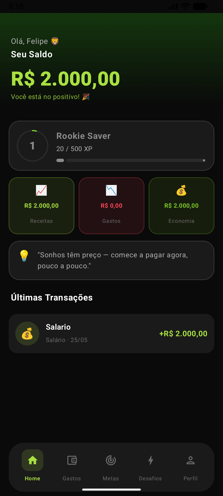
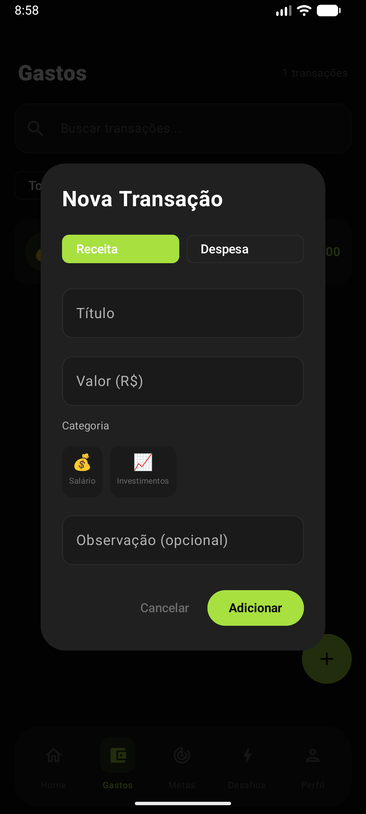

<p align="center">
  
  
  
  
</p>

---

## Descrição

CresUp transforma o controle financeiro em uma experiência moderna, motivadora e visualmente premium. Inspirado em Duolingo, Revolut e Monzo, o app é direcionado à Geração Z e jovens adultos que querem evoluir financeiramente de forma engajante.

## Tecnologias

| Tecnologia | Versão | Uso |
|---|---|---|
| Kotlin | 2.1.0 | Linguagem principal |
| Jetpack Compose | BOM 2024.12 | Interface declarativa |
| Material Design 3 | — | Sistema de design |
| MVVM + Clean Architecture | — | Arquitetura |
| Hilt | 2.51.1 | Injeção de dependência |
| Room | 2.6.1 | Persistência local (SQLite) |
| Firebase Firestore | BOM 33.10 | Banco de dados em nuvem |
| Firebase Auth | BOM 33.10 | Autenticação |
| Retrofit + OkHttp | 2.11 / 4.12 | Consumo de API REST |
| Coroutines + StateFlow | 1.9.0 | Assincronismo |
| Navigation Compose | 2.8.5 | Navegação entre telas |
| Coil | 2.7.0 | Carregamento de imagens |

## Requisitos do Sistema

- Android 8.0+ (API 26)
- Android Studio Ladybug | 2024.2.1+
- JDK 17

## Instalação

```bash
# Clone o repositório
git clone https://github.com/felipeXZZ/CresUp-Financas-Gamificadas.git
cd CresUp-Financas-Gamificadas

# Abra no Android Studio e sincronize o Gradle
# Execute no dispositivo ou emulador
```

## Estrutura do Projeto

```
app/src/main/java/com/cresup/app/
├── data/
│   ├── local/          # Room: entities, DAOs, AppDatabase
│   ├── remote/         # Retrofit: API, DTOs
│   └── repository/     # Implementações dos repositórios
├── di/                 # Módulos Hilt
├── domain/
│   ├── model/          # Modelos de domínio
│   └── repository/     # Interfaces dos repositórios
└── presentation/
    ├── ui/
    │   ├── components/  # Componentes reutilizáveis
    │   ├── navigation/  # NavGraph + BottomNav
    │   ├── screens/     # Telas do app
    │   └── theme/       # Cores, tipografia, tema
    └── viewmodel/       # ViewModels por tela
```

## Funcionalidades

### Dashboard
- Saldo total em tempo real
- Resumo mensal (receitas, despesas, economia)
- Progresso de XP e nível do usuário
- Streak de dias ativos
- Meta ativa com barra de progresso
- Frase motivacional via API (ZenQuotes, com fallback local)
- Últimas transações

### Gastos
- Adicionar receitas e despesas com categorias
- Busca e filtro por tipo
- Swipe para deletar
- 11 categorias: Alimentação, Delivery, Transporte, Estudos, Academia, Lazer, Streaming, Investimentos, Compras, Salário, Outros
- Feedback de XP ao registrar transações

### Metas
- Criar metas com presets (Viagem, iPhone, Setup Gamer, etc.)
- Contribuir para metas com qualquer valor
- Barra de progresso animada
- Detecção automática de meta concluída

### Desafios
- 5 desafios pré-definidos
- Sistema de ativação e registro de progresso diário
- Recompensa de XP ao concluir
- Visual de status: pendente / ativo / concluído

### Perfil
- Avatar com emoji
- Nome editável
- Nível e XP com barra circular
- Estatísticas: streak atual, recorde, metas concluídas
- Sistema de conquistas (badges)

## Gamificação

| Ação | XP Ganho |
|---|---|
| Registrar despesa | +10 XP |
| Registrar receita | +20 XP |
| Criar meta | +30 XP |
| Contribuir para meta | +25 XP |
| Concluir desafio | +XP variável |

### Níveis

| Nível | Nome | XP necessário |
|---|---|---|
| 1 | Poupador Iniciante | 0 – 499 |
| 2 | Construtor de Riqueza | 500 – 1499 |
| 3 | Especialista Financeiro | 1500 – 3499 |
| 4 | Elite Financeira | 3500+ |

## API Utilizada

**ZenQuotes API** — frases motivacionais aleatórias (`GET https://zenquotes.io/api/random`), consumida via Retrofit + OkHttp. Em caso de falha de rede, o app exibe automaticamente uma das 12 frases motivacionais em português armazenadas localmente.

## Tratamento de Erros

- Validação em todos os formulários com mensagens claras
- Fallback local em português para API de frases motivacionais
- Snackbars para feedback de sucesso e erro
- Estados de vazio com ilustrações

## Geração de APK

No Android Studio: **Build → Build Bundle(s) / APK(s) → Build APK(s)**

Ou via terminal:
```bash
./gradlew assembleRelease
```

## Relatório Técnico

O relatório técnico detalhado do projeto está disponível em [RELATORIO_TECNICO.md](RELATORIO_TECNICO.md).

## Capturas de Tela

<p align="center">
  
  
  
</p>
<p align="center">
  
  
</p>

## Autor

Projeto acadêmico — Disciplina de Programação Mobile, UNASP
